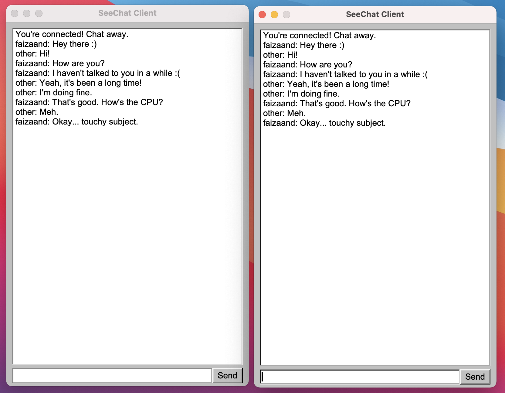

# SeeChat




SeeChat is a simple chat application written in C++. This repository includes the server as well as the GUI client for the chat service. It's nothing fancy - I only plan to have it support text. The goal is to improve my familiarity with building a C++ project from start to finish. Over time, I may add functionality over time or refactor to improve my understanding of the language.

## Getting Started
Follow these instructions to get the project running on your local system.

### Prerequisites
This project requires you to have the [FLTK](https://www.fltk.org) library installed. Go ahead and download v1.3.5 from their website, and follow the instructions to build via CMake (found in their `README.CMake.txt` file). It's crucial that you perform the build steps for CMake, because we rely on the default generated CMake configuration.

### Building
In the terminal, perform the following: 
```shell
mkdir build
cd build
cmake --build ..
```

This will generate two output files: one for the server, which must be run in the terminal; and one for the client, which can be run as any other application on your system.

### Running
Now that you have the `SeeChat-Server` and `SeeChat-Client.*` executables, you can go ahead and run the application.

**To start the server**, open a terminal and run `./SeeChat-Server` in the same directory as that file. Enter your desired port, and you're good to go.

**To start the client**, simply run the client executable (double-click on Windows and macOS), enter the server's port and desired username, and you're ready to chat. 

Since the chat application only works on localhost right now, you will need to run at least two instances of the client on your system in order to chat. Up to 100 clients are allowed.

> **On macOS**, the operating system prevents you from running more than one instance of an app at a time. To get around this, open a terminal, navigate to the directory that you kept `SeeChat-Client.app`, and run `open -n SeeChat-Client.app`. This will open another independent instance of the client.

## Built With
* [FLTK](https://www.fltk.org)
* Love <3

## Contributing
I would like to stress that this project is solely for my own education. Therefore, I am not encouraging contributions for the sake of improving the software, since this is merely a tool to improve my knowledge. That said, I will welcome any contributions if you feel that they will help me learn more about building software in C++. 

## Author
* [**Faizaan Datoo**](https://faizaan.dev) 

## License
This project is licensed under the MIT License. See [LICENSE](LICENSE) for more information.
